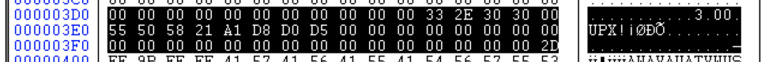

# *Anti-UPX Unpacking*

## Authorship information
* Nickname: *hackeT*
* Twitter: *https://twitter.com/T_8ase*
* Linkedin: *https://www.linkedin.com/in/tatsuya-hasegawa-aa3279142/*
  
## Technique Information
* Technique Title: **Anti-UPX Unpacking**
* Technique category: **packers**
* MITRE ATT&CK category: **Defense Evasion::Obfuscated Files or Information::Software Packing [T1027.002]**
* MBC category: **Anti-Static Analysis::Software Packing::UPX [F0001.008]**
* Technique description: 

Anti-UPX Unpacking is the technique to prevent malware from being unpacked by tools like "upx" easily.
UPX packed binary indicates that the section names starting with UPX followed by a number (UPX0 and UPX1) and the string “UPX!” at the end of the PE header.
That is UPX reference structure is located at the end of the PE header and the header includes checksums, packed and unpacked sizes, and compression details.

There are some methods to bypass unpacking by a tool like "upx -d" since a long time ago.

One easy way is to change section names to different strings, this is the example. The normal section names packed by UPX are "UPX0", "UPX1" .. and ".rsrc".
The unpack command "upx -d" raises this kind of exception of "CantUnpackException: file is possibly modified/hacked/protected; take care!" in this case and results in preventing from unpacking.

 

Another one is also zero-padding against any size or checksum infos in UPX reference structure.
The "upx -d" raises this kind of exception of "CantUnpackException: header corrupted" at this time and results in preventing from unpacking.

## References
UPX header structure from original source

- https://github.com/upx/upx/blob/master/src/stub/src/include/header.S

About PE executables

- https://bsodtutorials.wordpress.com/2014/11/14/upx-packing-and-anti-packing-techniques/

About ELF binaries

- https://blogs.jpcert.or.jp/en/2022/03/anti_upx_unpack.html

- https://cujo.com/upx-anti-unpacking-techniques-in-iot-malware/

- https://www.akamai.com/blog/security/upx-packed-headaches

## Detection rules

**yara**
./anti_upx_unpacking_pe.yar

